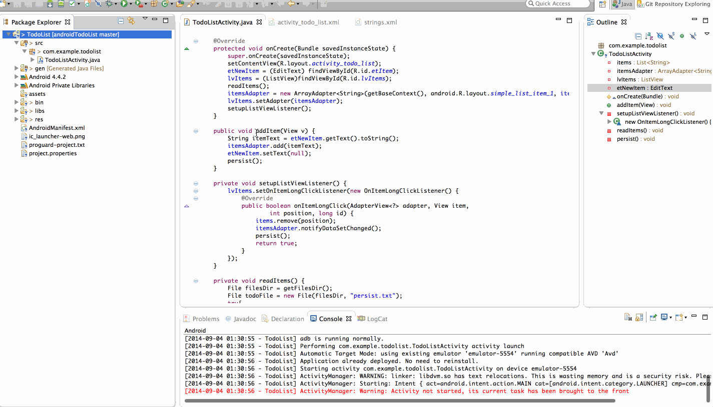

androidTodoList
===============

An Android App to add, delete and persist a todo list
I love playing cricket

This is an Android demo application for a todo list functionality.
Time spent: 7.5 hours spent in total. 3 hours in getting the app working from scratch. 4.5 hrs in understanding how to club it with git as this was almost my first time figuring that part out.
Completed user stories:
	•	 Required: User can add items in a todo list through a text field and an add button, where the text field appears with a hint to indicate whats required in the field. The item list should follow a listview. The text field and the button should be at the lower end of the view and shouldnt override with the list view. 
	•	 Required: When holding the click for long on an item, the item should get removed from the list.
	•	 Required: When the actions are performed, the list should get persisted in a file. When the app re-opens, the data should be recovered from the file. 